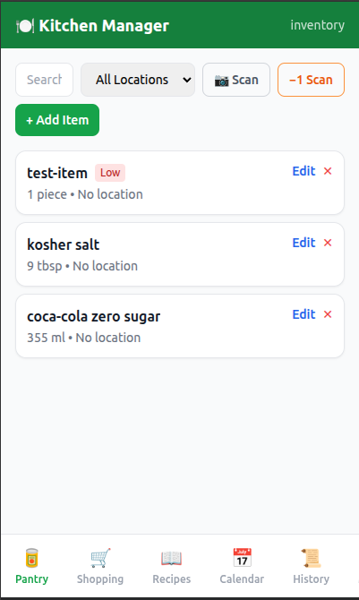
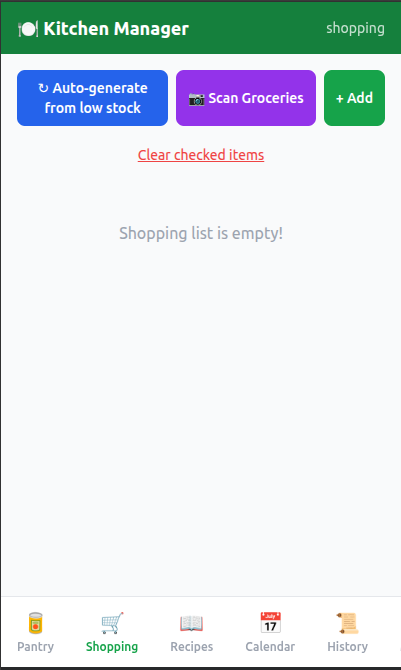
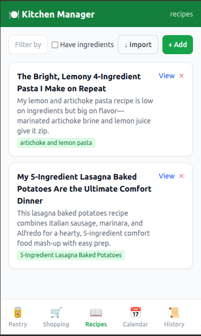
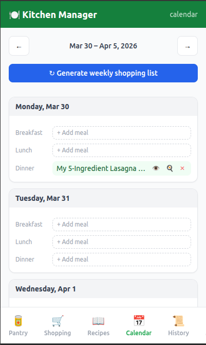
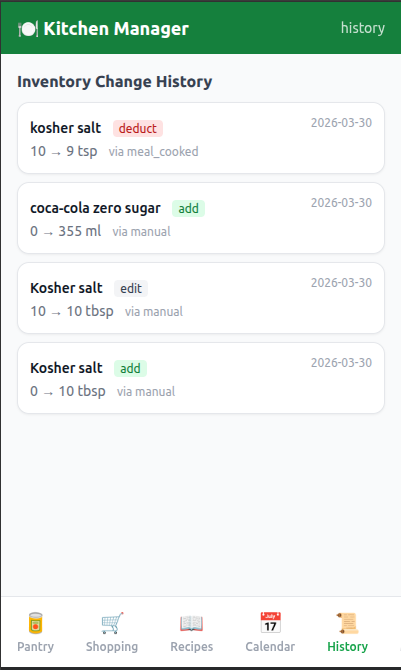

# Kitchen Manager

A self-hosted kitchen management app for tracking pantry inventory, planning meals, managing recipes, and generating shopping lists. Runs as a single Go binary with a SQLite database and an Alpine.js frontend — no external services required.


## Features

- **Pantry / Inventory** — Track items with quantities, units, locations, expiry dates, and low-stock thresholds. Barcode scanning via phone camera.

- **Shopping List** — Manual items, auto-generated from low-stock thresholds, pulled from recipes, or from the weekly meal calendar.

- **Recipes** — Import recipes from URLs (JSON-LD structured data extraction), paste HTML, or add manually. Ingredients auto-link to inventory items by name.

- **Meal Calendar** — Schedule recipes on a weekly calendar. View, cook, and track meals. Cooking a recipe deducts ingredients from inventory.

- **Meal History** — Log of cooked meals with ingredient deductions.

- **Expiry Tracking** — See items expiring soon across the pantry.
- **WebSocket sync** — Real-time updates across multiple browser sessions.
- **Google OAuth** — Optional authentication with an email allowlist.


## Tech Stack

- **Backend:** Go, SQLite (`modernc.org/sqlite`), `net/http`
- **Frontend:** Alpine.js SPA, Tailwind CSS (CDN), ZXing.js for barcode scanning
- **Proxy:** Caddy (automatic HTTPS)
- **Recipe import:** JSON-LD / schema.org extraction, Splash headless browser sidecar for JS-rendered pages

## Quick Start

### Local dev (no auth, plain HTTP)

```bash
git clone https://github.com/you/kitchen-manager
cd kitchen-manager
go run .
# Open http://localhost:8080
```

### Local dev (self-signed HTTPS)

```bash
SELF_SIGNED_TLS=true go run .
# Open https://localhost:8443
```

### Production (Docker + Caddy + OAuth)

1. Copy and fill in the environment file:
   ```bash
   cp .env.example .env
   ```

2. Edit `.env` — see [Configuration](#configuration) below.

3. Set up your `Caddyfile` (see [`Caddyfile.example`](Caddyfile.example)):
   ```
   your-domain.com {
     reverse_proxy app:8080
   }
   ```

4. Start the stack:
   ```bash
   docker compose up -d
   ```

## Configuration

All configuration is via environment variables (or `.env` file):

| Variable | Default | Description |
|---|---|---|
| `DB_PATH` | `./kitchen.db` | Path to SQLite database file |
| `SELF_SIGNED_TLS` | — | Set to `true` to auto-generate a self-signed cert and serve HTTPS on `:8443` |
| `OAUTH_ENABLED` | — | Set to `true` to require Google OAuth login |
| `OAUTH_ALLOWED_EMAILS` | — | Comma-separated list of allowed email addresses |
| `GOOGLE_CLIENT_ID` | — | Google OAuth client ID |
| `GOOGLE_CLIENT_SECRET` | — | Google OAuth client secret |
| `SESSION_SECRET` | — | Random 32-byte hex string for signing session cookies (`openssl rand -hex 32`) |
| `BASE_URL` | — | Public URL of the app, used to build the OAuth redirect URI (e.g. `https://example.com`) |
| `ANTHROPIC_API_KEY` | — | Reserved for future AI features (not currently required) |

### Google OAuth Setup

1. Go to [Google Cloud Console](https://console.cloud.google.com/) → APIs & Services → Credentials
2. Create an OAuth 2.0 Client ID (Web application)
3. Add `https://your-domain.com/auth/callback` as an authorised redirect URI
4. Copy the client ID and secret into `.env`
5. Set `OAUTH_ALLOWED_EMAILS` to the emails you want to grant access

## Units System

The app supports 14 units across three dimensions:

| Dimension | Units |
|---|---|
| Mass | `g`, `kg`, `oz`, `lb` |
| Volume | `ml`, `L`, `tsp`, `tbsp`, `cup` |
| Count | `piece`, `clove`, `can`, `jar`, `bunch` |

Units must be the same dimension to convert. Each inventory item has a `preferred_unit` used for display and threshold calculations.

## Recipe Import

Recipes can be imported from URLs that include [schema.org/Recipe](https://schema.org/Recipe) JSON-LD structured data (most major recipe sites). For sites that block server-side fetching (Cloudflare-protected), use the **Paste** tab to paste the page HTML directly from your browser.

The import extracts: name, description, servings, instructions, tags, and ingredients (with quantities and units). Ingredient names are matched against your inventory automatically.

### Splash Sidecar

The Docker Compose setup includes a [Splash](https://splash.readthedocs.io/) headless browser sidecar that renders JS-heavy pages server-side before extraction. It is used automatically and falls back to a direct HTTP fetch if unavailable.

## Development

```bash
# Run tests
go test ./...

# Build binary
go build -o kitchen_manager
```

Tests use in-memory SQLite — no external dependencies needed.

## Project Structure

```
.
├── main.go               # Router, TLS bootstrap, static file serving
├── db.go                 # Schema creation and migrations
├── models.go             # Shared structs
├── auth.go               # Google OAuth flow
├── tls.go                # Self-signed cert generation
├── handlers/             # HTTP handlers (one file per domain)
│   ├── inventory.go
│   ├── recipes.go
│   ├── recipe_import.go
│   ├── shopping.go
│   ├── calendar.go
│   ├── meals.go
│   ├── history.go
│   ├── settings.go
│   └── ws.go             # WebSocket broadcast
├── services/             # Business logic spanning multiple tables
├── units/                # Unit definitions, validation, conversion
└── static/
    └── index.html        # Entire frontend (Alpine.js SPA)
```

## License

MIT
